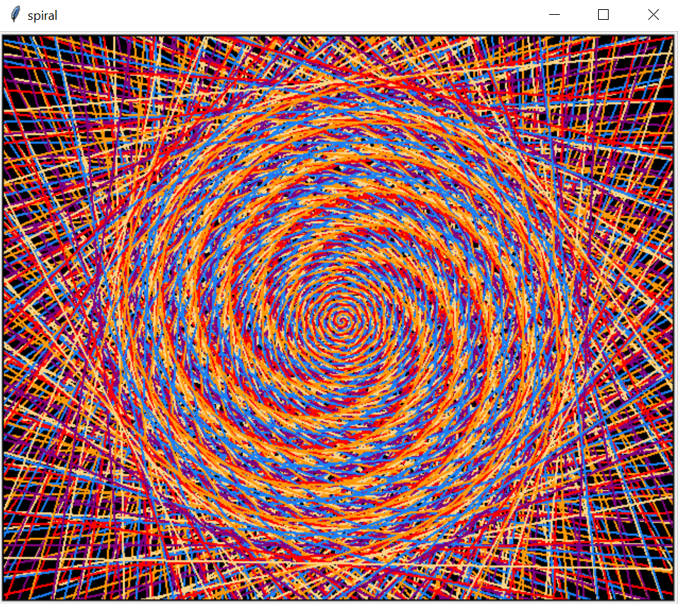

# python-turtle-graphics  
a modest collection of drawings made with Python's [Turtle](https://docs.python.org/3/library/turtle.html) module.  

## how to draw    
to use the `turtle` module imported in each example's code, you must have [tkinter](https://docs.python.org/3/library/tkinter.html#module-tkinter) installed.    
as of 30.03.2021, the Python 3.9.2 Windows installer includes tkinter by default.  
one other way to install tkinter: 
* open your Python 3 shell and write  
``>>> import tkinter``  
``>>> tkinter._test()``
* once you see a 'test' window like this, you know tkinter is displaying graphics properly.  
  
from there, run a file and enjoy as the drawing takes shape.

## drawing examples  
<strong>[spirograph](https://www.geeksforgeeks.org/print-a-spirograph-using-turtle-in-python/)</strong>  

<strong>[rainbow benzene](https://www.codium.co.in/2020/07/rainbow-benzene-tutorial-turtle-python.html)</strong>  

<strong>[spiral](https://www.geeksforgeeks.org/draw-black-spiral-pattern-using-turtle-in-python/)</strong>  

<strong>[mandala](https://github.com/ythecombinator/python-homework)</strong>  

## credits  
source code for each drawing linked above.  
